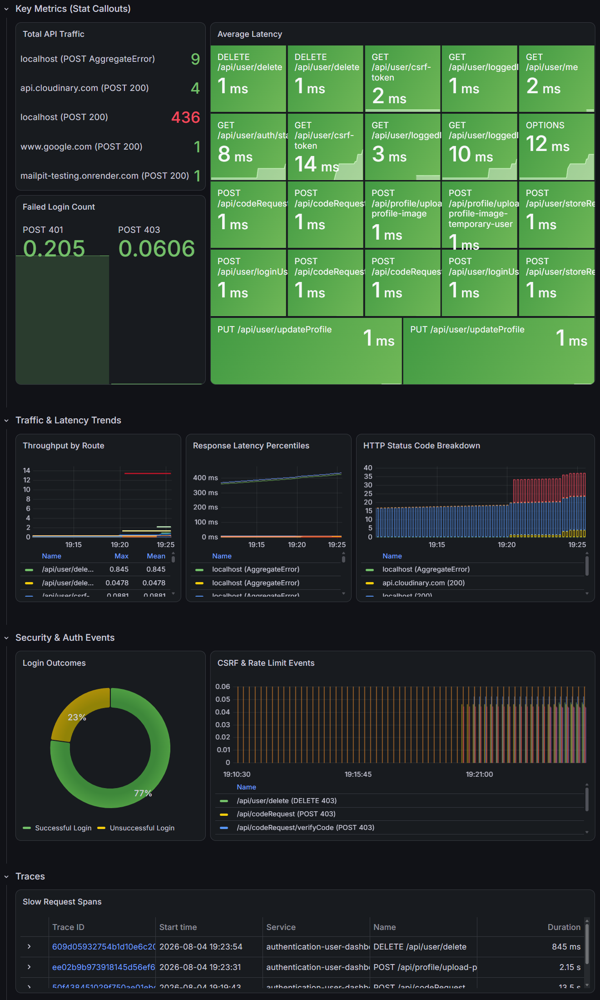
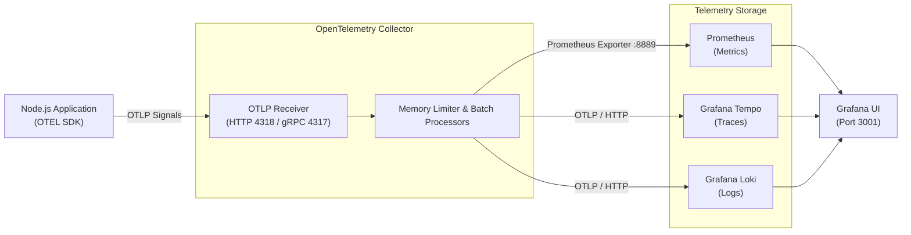

# Observability Stack & OpenTelemetry Collector
⭐ A local observability backend suite powered by Docker Compose, OpenTelemetry Collector, Prometheus, Grafana Tempo, Grafana Loki, and Grafana.

This repository provides a unified telemetry pipeline designed to collect, process, and visualize **Metrics, Traces, and Logs** emitted by the [Authentication User Dashboard Application](https://github.com/Mel000000).

---
## 📊 Live System Dashboard



> **Key Performance & Security Highlights:**
> * **RED Metrics & Traffic:** Real-time visibility into HTTP throughput by route and percentile request latency (p50, p95, p99).
> * **Security Audit Telemetry:** Dedicated tracking of auth outcomes, including login successes (`200 OK`), invalid credentials (`401 Unauthorized`), CSRF violations (`403 Forbidden`), and rate-limiting blocks (`429 Too Many Requests`).
> * **Correlated Telemetry:** Native OpenTelemetry ingestion allowing trace-to-log correlation across backend services.

---

## Table of Contents
- [Architecture](#architecture)
- [Services Included](#services-included)
- [Getting Started](#getting-started)
- [Ports & Endpoints](#ports--endpoints)
- [Configuration Details](#configuration-details)
- [License](#license)

---

## Architecture


## Services Included

| Service | Image | Container Port | Host Port | Purpose |
| :--- | :--- | :--- | :--- | :--- |
| **OTEL Collector** | `otel/opentelemetry-collector-contrib` | 4317, 4318, 8889 | 4317, 4318, 8889 | Ingests OTLP signals, processes them, and routes to backends. |
| **Prometheus** | `prom/prometheus:latest` | 9090 | 9090 | Scrapes metrics from the Collector's Prometheus exporter. |
| **Tempo** | `grafana/tempo:latest` | 3200, 4317, 4318 | 3300, 4319, 4320 | Distributed tracing backend storing trace blocks locally. |
| **Loki** | `grafana/loki:latest` | 3100 | 3200 | Log aggregation system for OTLP application logs. |
| **Grafana** | `grafana/grafana:latest` | 3000 | 3001 | Visualization UI pre-configured with Prometheus, Tempo, & Loki. |

---

## Getting Started

### Prerequisites
* **Docker** and **Docker Compose** installed.
* An application exporting telemetry via OTLP (e.g., OpenTelemetry Node.js SDK).

### Usage

1. **Clone the repository:**
   ```bash
   git clone https://github.com/Mel000000/observability-platform.git
   cd observability-platform
   ```
2. **Start the stack:**
   ```bash
   docker compose up -d
   ```
3. **Verify running containers:**
   ```bash
   docker compose ps
   ```
4. **Access the UIs:**
   - Grafana: http://localhost:3001
   - Prometheus: http://localhost:9090
   - Collector Metrics Endpoint: http://localhost:8889/metrics

---

 ## Ports & Endpoints

| Protocol / Target | Ingestion Port | Usage |
| :--- | :--- | :--- |
| **OTLP / HTTP** | `4318` | Send traces, metrics, and logs over HTTP from your application. |
| **OTLP / gRPC** | `4317` | Send traces, metrics, and logs over gRPC from your application. |
| **Prometheus Scrape** | `8889` | Scraped every 15s by Prometheus. |

---

## Configuration Details

### 1. OpenTelemetry Collector (`otel-collector/config.yaml`)
* **Receivers:** Ingests OTLP via gRPC (`0.0.0.0:4317`) and HTTP (`0.0.0.0:4318`).
* **Processors:**
  * `memory_limiter`: Prevents OOM by setting check intervals and memory limits (256 MiB).
  * `batch`: Batches telemetry data before sending to exporters for performance optimization.
* **Exporters:** Routes metrics to Prometheus (`:8889`), logs to Loki (`http://loki:3100/otlp`), and traces to Tempo (`http://tempo:4318`).

### 2. Prometheus (`prometheus/prometheus.yml`)
Scrapes metrics exposed by the OTEL collector at `otel-collector:8889` every 15 seconds.

### 3. Grafana Auto-Provisioning (`grafana/provisioning`)
Data sources are automatically provisioned on launch:
* **Prometheus** (Default metrics provider)
* **Tempo** (Trace search and visualization)
* **Loki** (Log ingestion and querying)

---

## License

This project is licensed under the MIT License.
